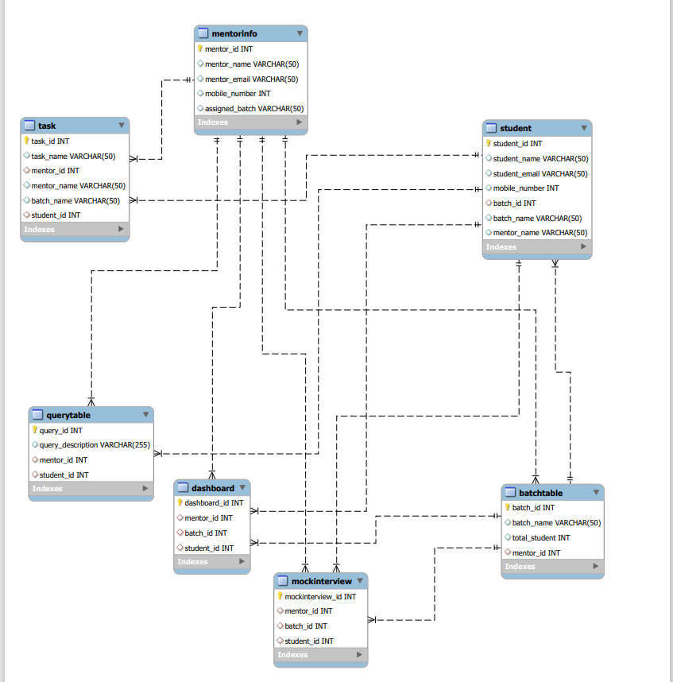

# Design DB model for Guvi Zen class

1. Using `MYSQL Workbench` IDE to achive the given task.
2. Here I create seven tables, the names are `student, dashboard, mockinterview, mentorinfo, querytable, task and batchtable`.
3. How I create the tables like using below querys,

      * create table student (student_id int primary key, student_name varchar(50), student_email varchar(50), mobile_number int(15), batch_id int(20), batch_name varchar(50), mentor_name varchar(50));
      * create table task (task_id int primary key, task_name varchar(50), mentor_id int(20), mentor_name varchar(50), batch_name varchar(50), student_id int, foreign key (student_id) references student(student_id));
      * create table dashboard (dashboard_id int primary key, mentor_id int(20), batch_id int(20), student_id int, foreign key (student_id) references student(student_id));
      * create table queryTable (query_id int primary key, query_description varchar(255), mentor_id int(20), student_id int, foreign key (student_id) references student(student_id));
      * create table mockinterview (mockinterview_id int primary key, mentor_id int, batch_id int, student_id int, foreign key (student_id) references student(student_id));
      * create table batchtable (batch_id int primary key, batch_name varchar(50), total_student int, mentor_id int);
      * create table mentorinfo (mentor_id int primary key, mentor_name varchar(50), mentor_email varchar(50), mobile_number int, assigned_batch varchar(50));
      * ALTER TABLE `student` ADD FOREIGN KEY (`batch_id`) REFERENCES `batchtable` (`batch_id`);
      * ALTER TABLE `task` ADD FOREIGN KEY (`mentor_id`) REFERENCES `mentorinfo` (`mentor_id`);
      * ALTER TABLE `batchtable` ADD FOREIGN KEY (`mentor_id`) REFERENCES `mentorinfo` (`mentor_id`);
      * ALTER TABLE `querytable` ADD FOREIGN KEY (`mentor_id`) REFERENCES `mentorinfo` (`mentor_id`);
      * ALTER TABLE `dashboard` ADD FOREIGN KEY (`mentor_id`) REFERENCES `mentorinfo` (`mentor_id`);
      * ALTER TABLE `dashboard` ADD FOREIGN KEY (`batch_id`) REFERENCES `batchtable` (`batch_id`);
      * ALTER TABLE `mockinterview` ADD FOREIGN KEY (`mentor_id`) REFERENCES `mentorinfo` (`mentor_id`);
      * ALTER TABLE `mockinterview` ADD FOREIGN KEY (`batch_id`) REFERENCES `batchtable` (`batch_id`);  

4. Here I attached query file `mysql_day2_task_querys.sql` and design file `msql-er-design.pdf and sql-design.mwb`

## For your refereces:

